# CloudCampus Stay

## A Highly Available Hotel Booking Web App on AWS

CloudCampus Stay is a hotel booking web application prototype designed for international students and their families visiting U.S. campuses for orientation, move-in, campus tours, family visits, and graduation trips.

This project demonstrates how to deploy a highly available web application on AWS using an internet-facing Application Load Balancer, EC2 instances in private subnets, an Auto Scaling Group across multiple Availability Zones, CloudWatch alarms, layered security groups, and Terraform.

---

## Project Goals

The goal of this project is to build a realistic cloud architecture for a small web application that requires:

- High availability across multiple Availability Zones
- Load balancing through an Application Load Balancer
- EC2 instances deployed in private subnets
- Auto Scaling Group management
- Health checks through an ALB target group
- CPU-based scaling with CloudWatch alarms
- Infrastructure as Code using Terraform

---

## Business Scenario

International students and their families often need short-term accommodation when visiting a U.S. campus for orientation, move-in, campus tours, family visits, or graduation.

CloudCampus Stay simulates a simple hotel booking platform for this scenario. The current version focuses on the AWS infrastructure design rather than full booking business logic.

Future versions could add a backend API, database integration, user authentication, and a real booking workflow.

---

## Architecture Overview

Users access the application through an internet-facing Application Load Balancer deployed in public subnets. The ALB forwards HTTP traffic to EC2 web servers running in private subnets across two Availability Zones.

The EC2 instances are launched and managed by an Auto Scaling Group. The ALB target group performs health checks against the `/health` endpoint on each EC2 instance. CloudWatch alarms monitor average CPU utilization and trigger Auto Scaling policies.

```text
Internet Users
      |
      v
Application Load Balancer
Public Subnet A + Public Subnet B
      |
      v
Target Group
      |
      v
Auto Scaling Group
      |
      +--> EC2 Web Server in Private Subnet A
      |
      +--> EC2 Web Server in Private Subnet B
      |
      v
CloudWatch Alarms + Auto Scaling Policies
```
---

## AWS Services Used

- Amazon VPC
- Public and private subnets
- Internet Gateway
- Amazon EC2
- EC2 Launch Template
- Auto Scaling Group
- Application Load Balancer
- Target Group
- Security Groups
- Amazon CloudWatch
- Terraform

---

## Key Architecture Decisions

### 1. Application Load Balancer in Public Subnets

The Application Load Balancer is deployed in public subnets because it is internet-facing and receives HTTP traffic from users.

The ALB listens on port 80 and forwards requests to the target group.

### 2. EC2 Instances in Private Subnets

The EC2 web servers are deployed in private subnets. They do not have public IPv4 addresses and cannot be accessed directly from the internet.

Users access the application only through the Application Load Balancer.

### 3. Auto Scaling Group Across Multiple Availability Zones

The Auto Scaling Group launches EC2 instances across two Availability Zones to improve availability.

The configuration uses:

- Minimum capacity: 2
- Desired capacity: 2
- Maximum capacity: 4

This allows the application to remain available even if one instance or Availability Zone has an issue.

### 4. Layered Security Groups

The project uses layered security groups:

- The ALB security group allows inbound HTTP traffic from the internet.
- The EC2 security group allows inbound HTTP traffic only from the ALB security group.

This prevents the EC2 instances from being directly exposed to the public internet.

### 5. Health Checks

The ALB target group uses the `/health` endpoint to check whether each EC2 instance is healthy.

If an instance fails the health check, the ALB stops routing traffic to that instance.

### 6. CloudWatch Scaling

CloudWatch alarms monitor average CPU utilization for the Auto Scaling Group.

The project includes:

- A high CPU alarm for scale-out
- A low CPU alarm for scale-in
- Auto Scaling policies connected to the alarms

The ASG minimum capacity remains 2 to preserve high availability.

---

## Application Features

The current frontend is a lightweight hotel booking prototype for campus visits.

Features include:

- Landing page for international students and families
- Room option cards
- Booking request form prototype
- Project explanation section
- EC2 instance metadata displayed in the footer

The footer displays:

- EC2 Instance ID
- Availability Zone
- Private IP address

This helps demonstrate that the application is being served by EC2 instances behind the Application Load Balancer.

---

## Screenshots

### Application served through the ALB

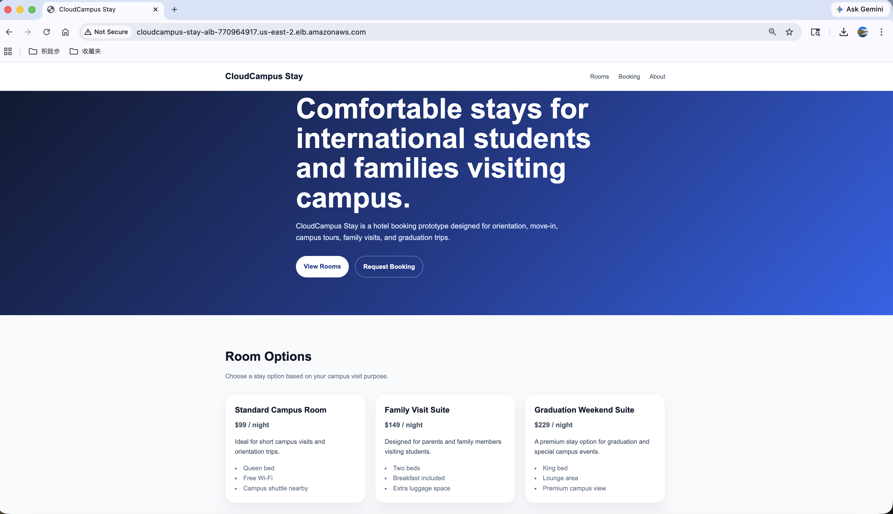

### Application served by EC2 instance in Availability Zone A

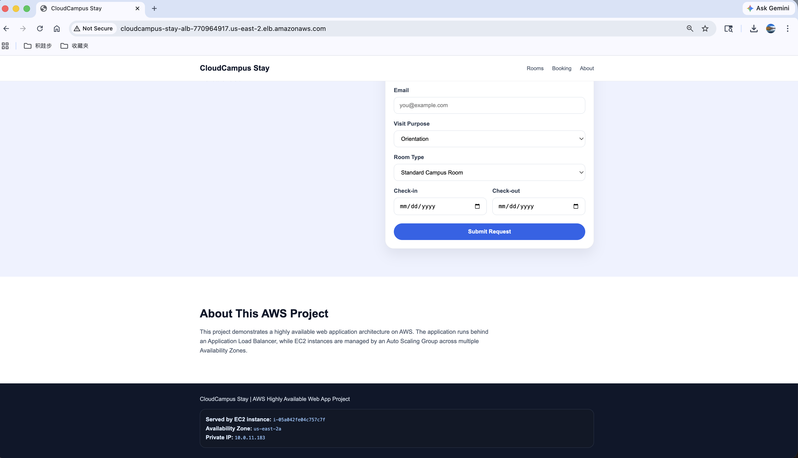

### Application served by EC2 instance in Availability Zone B

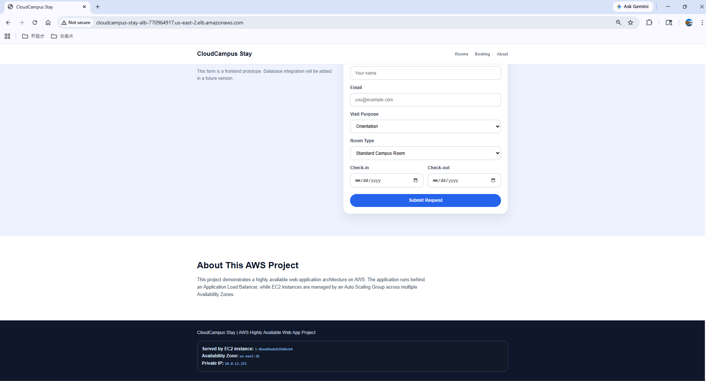

### Auto Scaling Group configuration

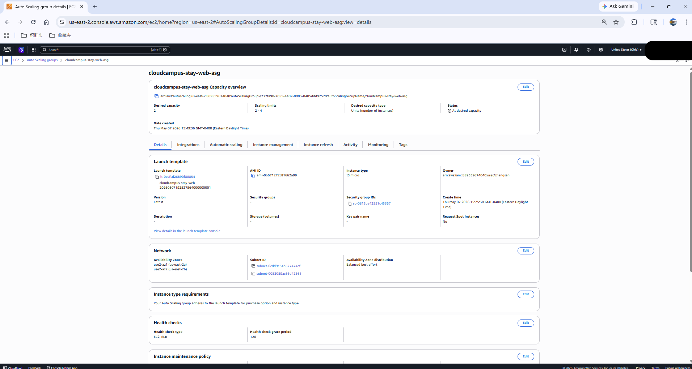

### Private EC2 instance in Availability Zone A

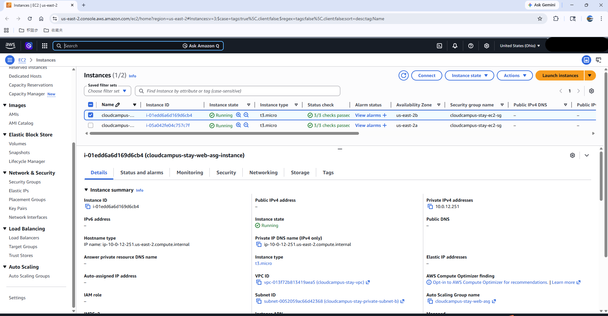

### Private EC2 instance in Availability Zone B

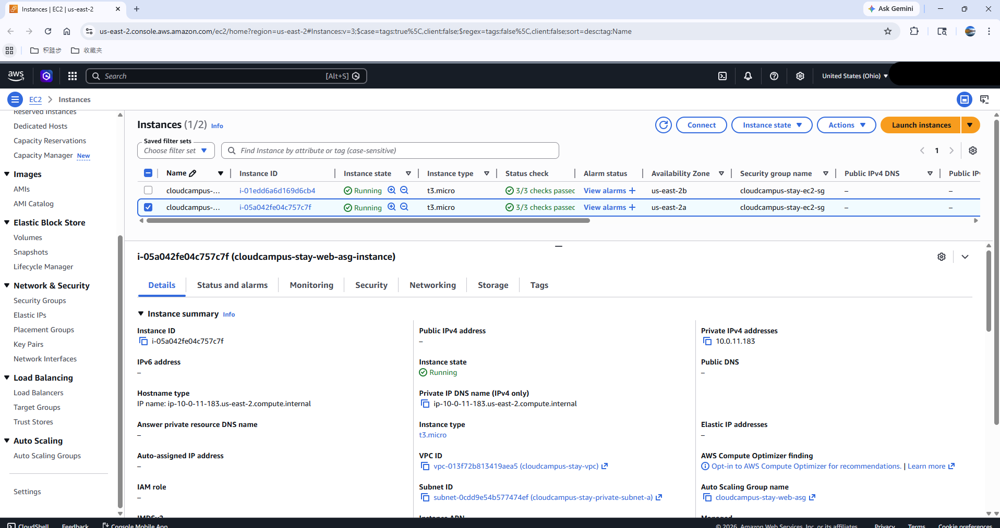

### Target group with healthy targets

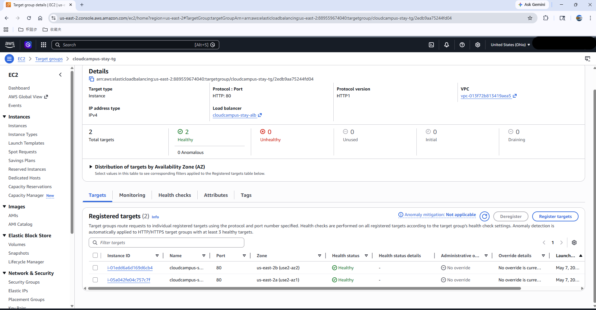

### ALB security group inbound rule

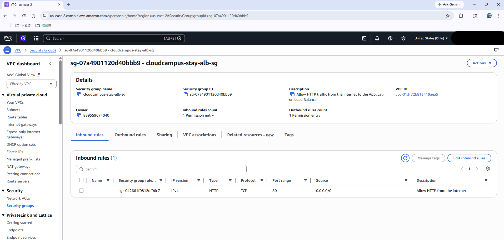

### ALB security group outbound rule

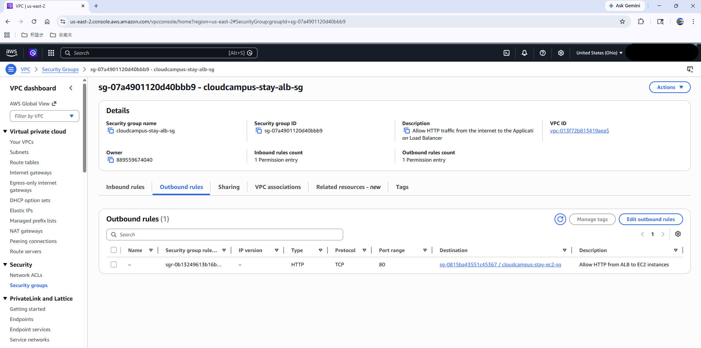

### EC2 security group inbound rule

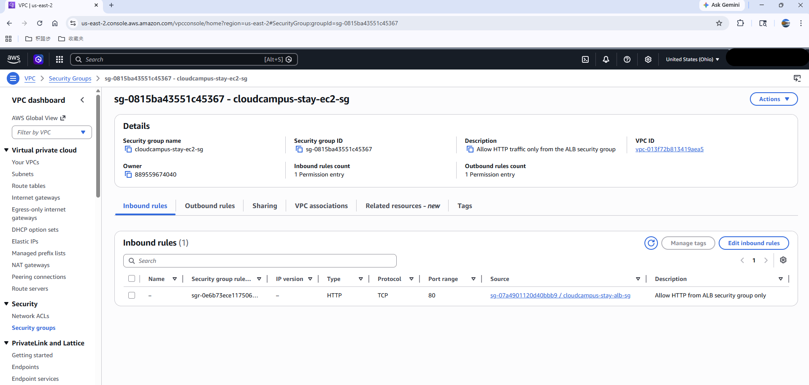

### CloudWatch alarms

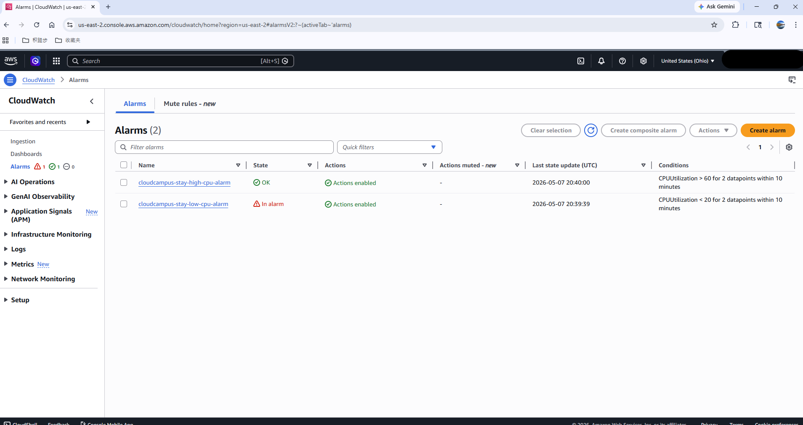

---

## Terraform Deployment Steps

The infrastructure was deployed incrementally using Terraform.

### Step 1: VPC and Subnets

Created a custom VPC with two public subnets and two private subnets across two Availability Zones.

### Step 2: Security Groups

Created separate security groups for the Application Load Balancer and EC2 web servers.

### Step 3: Application Load Balancer

Created an internet-facing Application Load Balancer, target group, and HTTP listener.

### Step 4: Launch Template

Created an EC2 Launch Template with Amazon Linux 2023, the EC2 security group, and user data for automatic web server bootstrapping.

### Step 5: Auto Scaling Group

Created an Auto Scaling Group across two private subnets and attached it to the ALB target group.

### Step 6: CloudWatch Scaling

Created CloudWatch alarms and Auto Scaling policies for CPU-based scaling.

---

## Validation Results

The project was validated through the AWS Console and browser testing.

Validation included:

- The ALB DNS successfully loaded the CloudCampus Stay web application.
- The target group showed two healthy EC2 targets.
- EC2 instances were running in private subnets with no public IPv4 addresses.
- The Auto Scaling Group maintained two running instances across two Availability Zones.
- Security groups enforced ALB-to-EC2 traffic flow.
- CloudWatch alarms were created for CPU-based scaling.

---

## Future Improvements

Future versions of this project could include:

- Amazon RDS for storing booking requests
- A backend API for form submission
- HTTPS using AWS Certificate Manager
- Custom domain using Route 53
- AWS Systems Manager Session Manager for private instance access
- CI/CD with GitHub Actions
- CloudWatch dashboard for monitoring
- Migration to ECS Fargate for containerized deployment

---

## Cleanup

To avoid ongoing AWS charges, the resources can be deleted with:

```bash
terraform destroy
```

This removes the Terraform-managed AWS infrastructure, including the ALB, Auto Scaling Group, EC2 instances, target group, security groups, subnets, and VPC.

---

## Project Summary

CloudCampus Stay demonstrates a highly available AWS web application architecture using Terraform.

The project shows how to design and deploy a realistic web application environment with public and private subnets, an internet-facing Application Load Balancer, private EC2 instances, Auto Scaling, health checks, CloudWatch alarms, and layered security groups.
